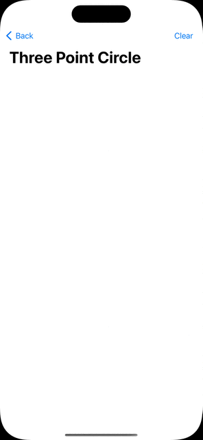

# SwiftUI Fun House

A small collection of SwiftUI examples.

## Custom Path Animations

A few demos showing techniques for animating `Shape`s using `AnimatablePair`s. 

### Some fun examples
- [Sine](https://mathworld.wolfram.com/Sine.html) wave
- [Lissajous](https://mathworld.wolfram.com/LissajousCurve.html) curve

## Gestures

Demos showing techniques for handling gestures.

### Some fun examples
- [Three Point Circle](https://www.johndcook.com/blog/2023/06/18/circle-through-three-points)

## Circular Progress Views

A few demos showing techniques for creating a circular progress view using a custom `ProgressViewStyle`.

## High Rail app views in SwiftUI

[High Rail](https://briancoyner.github.io/highrailapp/) is one my playground apps published to the [App Store](https://apps.apple.com/app/apple-store/id842021291). High Rail has a lot of custom views based on Core Animation and Core Graphics. In an effort to learn SwiftUI, I decided to publish SwiftUI demos showing how I re-created some of the app's views in SwiftUI. The amount of SwiftUI code (or lack thereof) is quite impressive compared to High Rail's custom Core Animation + Core Graphics code.

### SensorTrack record view
Here are the highlights:
- Custom `ButtonStyle` that:
  - draws a circular style "record" button
  - smoothly animates the "record" button between SensorTrack recording states (viz. idle, waiting for hardware response, recording armed, and recording).
  - See `RecordActionButtonStyle`

- Elapsed time view showing how to use a `Timer` to publish events every second using Combine.
  - Shows a technique for cancelling a `Publishers.Autoconnect` publisher when a view disappears.
  - See `ElapsedTimeView`

- Playing sounds when the user interacts with the "record" button.
  - see `RecordActionView`

- Using a `GeometryReader` and `RadialGradient` to make a nice looking background.
  - See `SensorTrackRecordActionView`

- Picker (segmented control) to simulate non-user interactive SensorTrack recording state changes (non-animating).
  - this allows for simulating how the view reacts to incoming hardware provided state changes
  - See `RecordActionDemoView`

## Customizable Rounded Rectangle

The `SwiftUI/RoundedRectangle` does not currently support selecting which corners to round. 
The `AdaptiveRoundedRectangle` implements a `SwiftUI/Shape` that enables selecting which corners to round. 
The API is similar to to `UIKit/UIBezierPath` and `UIKit/UIRectCorner`. 
